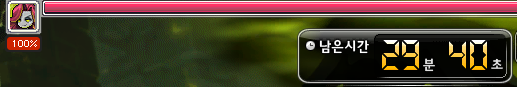
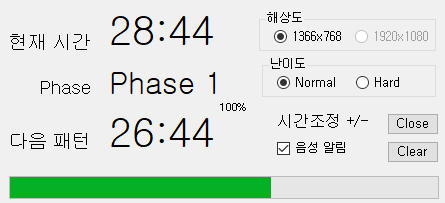

# 사용 전 주의사항
- 해당 프로그램을 사용함에 있어 발생할 수 있는 모든 사항은 사용자 개인의 책임입니다.
- 해당 프로그램을 사용하여 발생하는 모든 사항에는 개발자는 책임이 없음을 알려드립니다.

# 프로그램의 권한
- 해당 프로그램은 타 프로세스(MapleStory)에 접근하여 화면을 Read합니다. 
    - Discord의 화면 공유와 같은 권한
    - 이미지 검출용
- 해당 프로그램은 키보드의 입력을 확인합니다.
    - 게임 키뷰어와 같은 권한
    - +/-키를 입력받아 서버렉 시간 미세 조정을 위함

# Issue
비 개발자의 경우 닷넷프레임워크(.Net Framework)가 설치되어 있지 않을 수 있습니다.

이 경우 프로그램이 실행되지 않을 수 있습니다.

관련된 오류가 발생하는 경우 [link](https://dotnet.microsoft.com/ko-kr/download/dotnet-framework/net472)에서 다운로드 받으시면 해결됩니다.

# 사용방법
1. 진힐라 입장 전, 프로그램을 실행시킵니다.

2. 해상도와 난이도를 설정합니다.
- 현재 해상도는 1366x768만 가능(창모드)
- 난이도를 설정합니다.(노말진힐라, 하드진힐라)

3. 진힐라에 입장합니다.

**진힐라의 체력 %부분과 남은 시간은 가릴 경우 프로그램이 정상 동작하지 않을 수 있습니다.**

4. 체력이 감소하면 알아서 Phase가 이동되며, 낫베기 duration도 조정됩니다. (노말, 하드 별도)

5. 현재 시간이 다음 낫베기 패턴에 가까워지면 20초, 10초 전 음성으로 알림이 울립니다.
만약 음성 알림을 원하지 않는다면 음성 알림 check box를 해제하세요.

6. 서버 렉 등의 상황으로 인해 낫베기 타이밍이 밀릴 경우 num pad 우측이 +/- 키를 이용하여 1초 단위로 조정이 가능합니다.

7. 창이동이 필요할 경우 대부분 화면을 누른 채로 이동하면 이동 가능합니다.

8. clear가 필요할 경우 button을 누르면 초기화되지만, 사용은 비추천합니다.

9. close버튼을 누르면 창이 꺼집니다.

# 추후 개발 예정 사항 (일정 미정)
- 1920x1080 해상도 추가